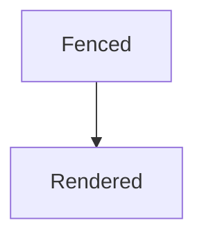
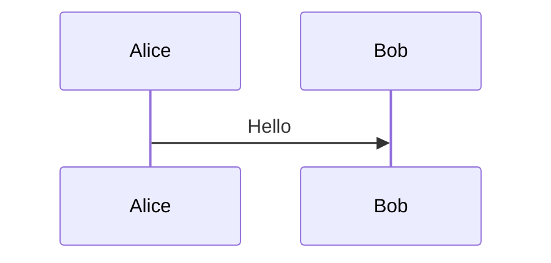
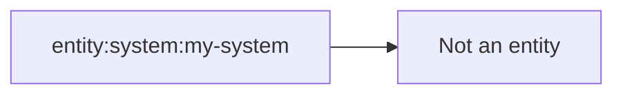

# Mermaid smoke test

## Fenced


```mermaid
graph TD
  A[Fenced] --> B[Rendered]
```

## Auto-detected

```
graph LR
  C[Auto-detected] --> D[Rendered]
```

## Sequence diagram links


```mermaid
sequenceDiagram
  participant Alice
  participant Bob
  links Alice: {"Dashboard": "https://example.com/alice"}
  Alice->>Bob: Hello
```

## Catalog entities


```mermaid
flowchart LR
  sys["entity:system:my-system"] --> other["Not an entity"]
```
