# Example Supported Mermaid Diagrams

## Supported by the Add On

## Graph/Flowchart

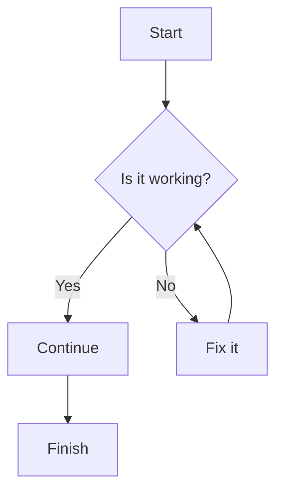

### Sequence Diagram

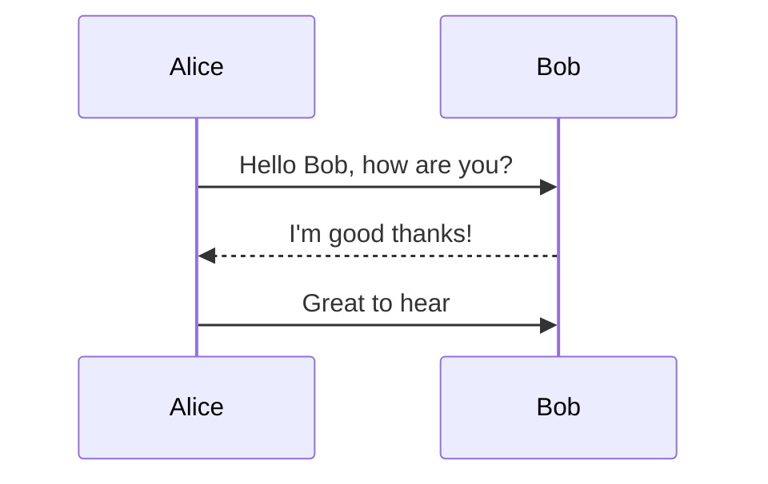

### Gantt

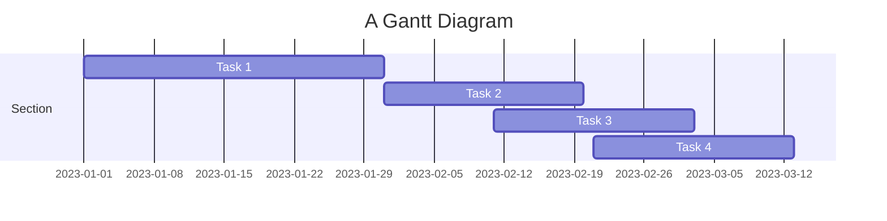

### Class Diagram

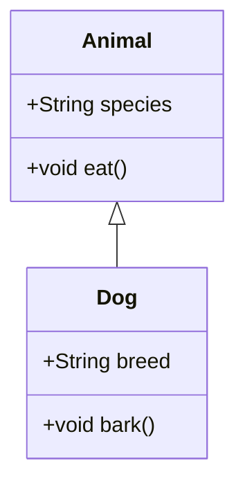

### State Diagram

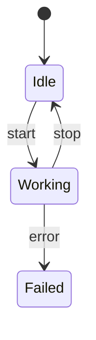

### Pie

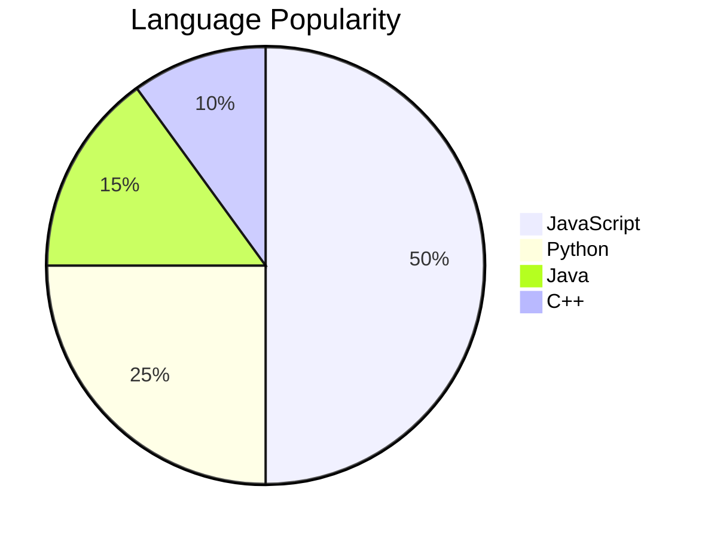

### erDiagram

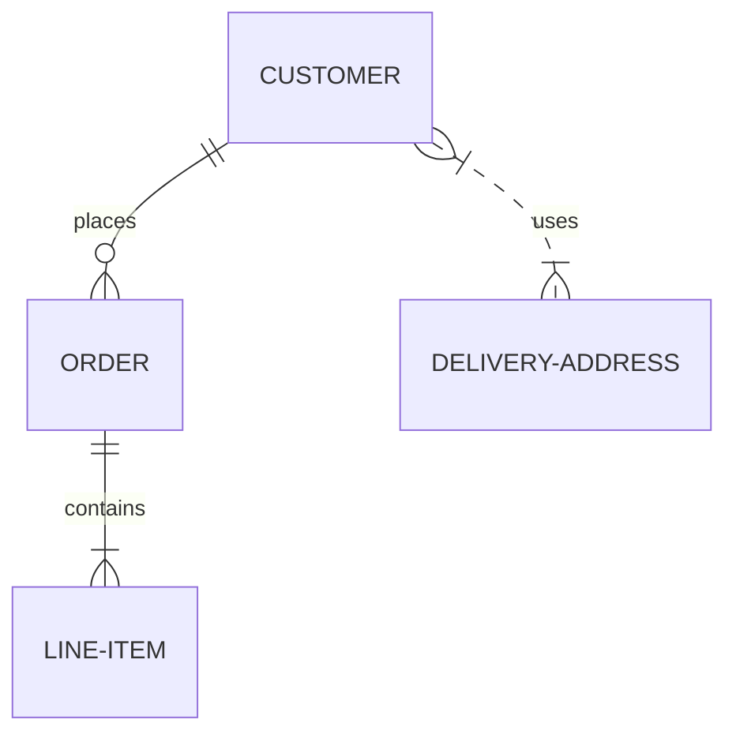

### Journey

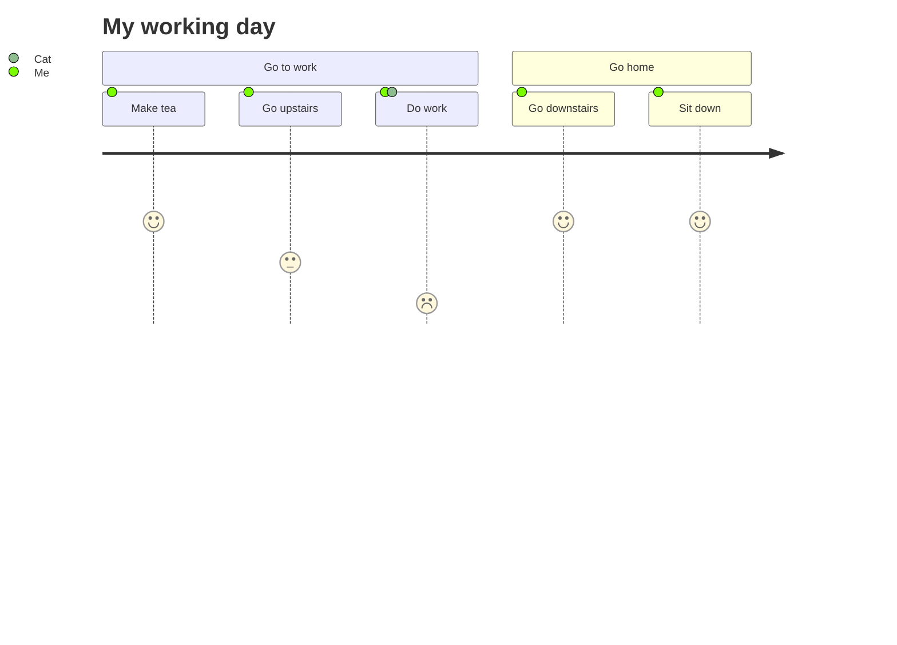

### Quadrant Chart

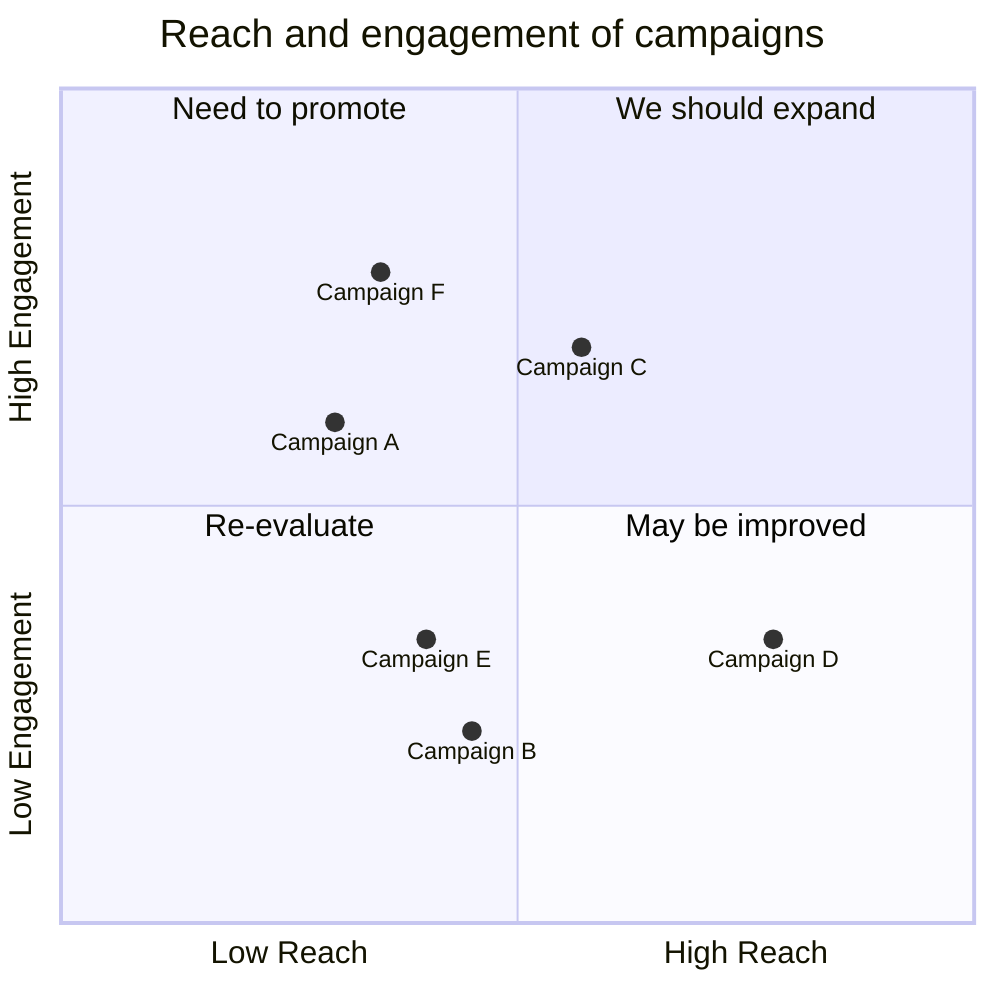

### Requirement Diagram

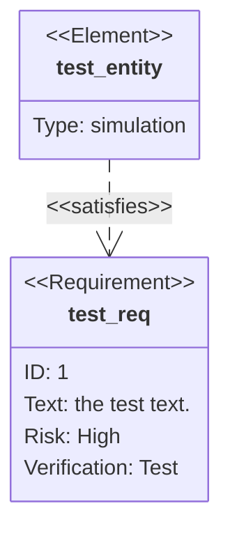

### GitGraph

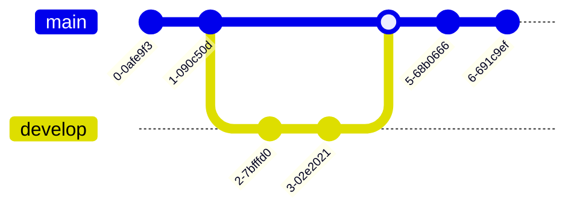

### MindMap

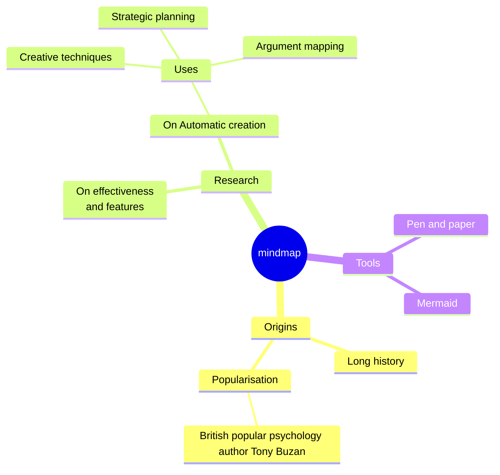

### Timeline

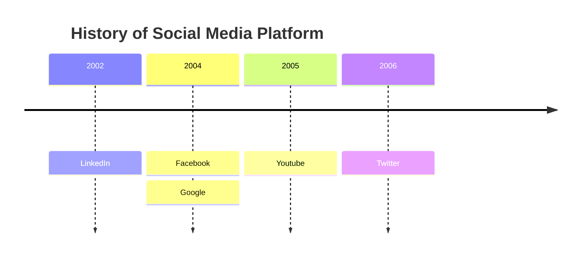

### XYChart-Beta

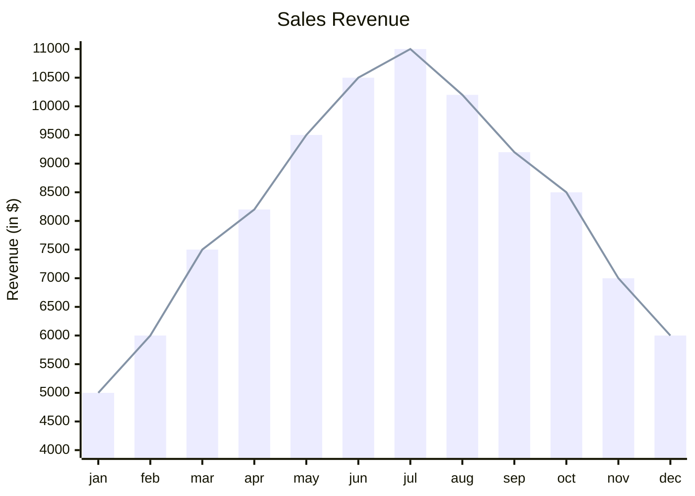

### Block Beta

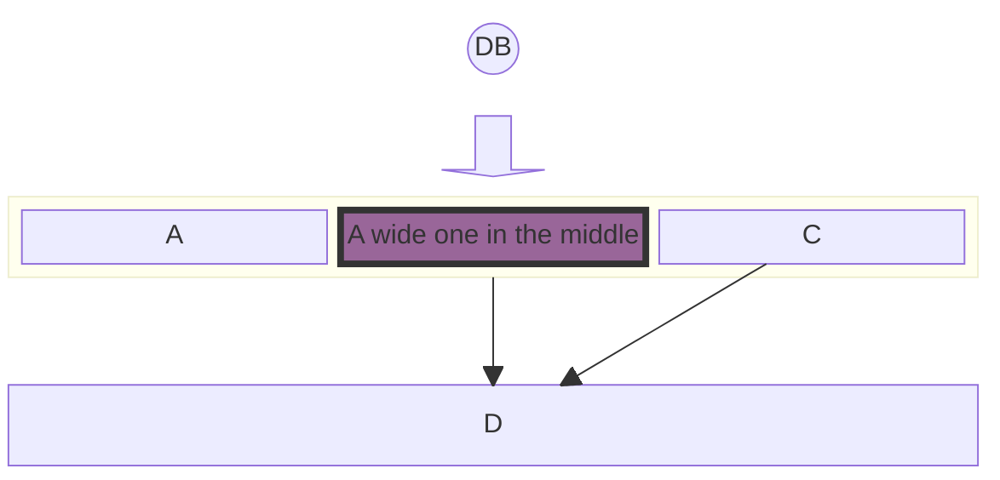

### Katex

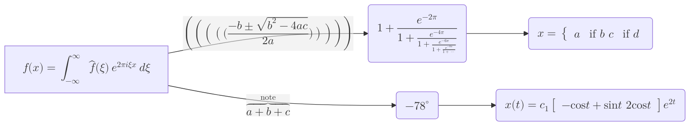

### Architecture Beta

```
architecture-beta
    group api(cloud)[API]

    service db(database)[Database] in api
    service disk1(disk)[Storage] in api
    service disk2(disk)[Storage] in api
    service server(server)[Server] in api

    db:L -- R:server
    disk1:T -- B:server
    disk2:T -- B:db
```

## Not yet supported

### ZenUml

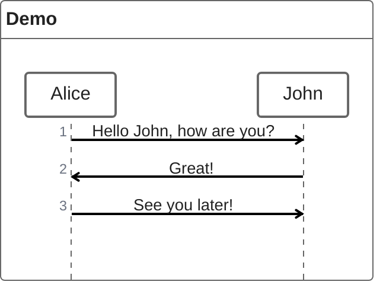

